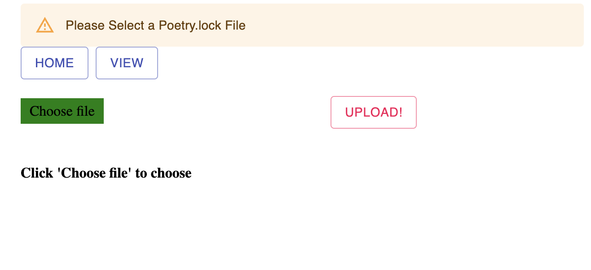
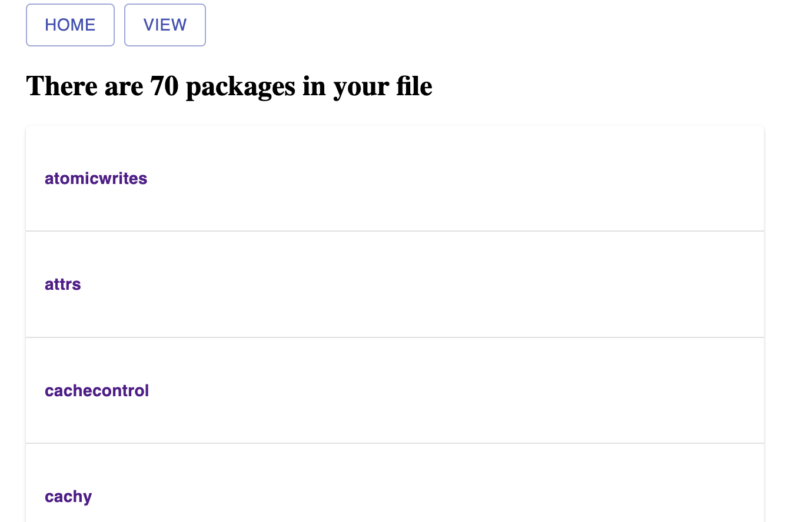
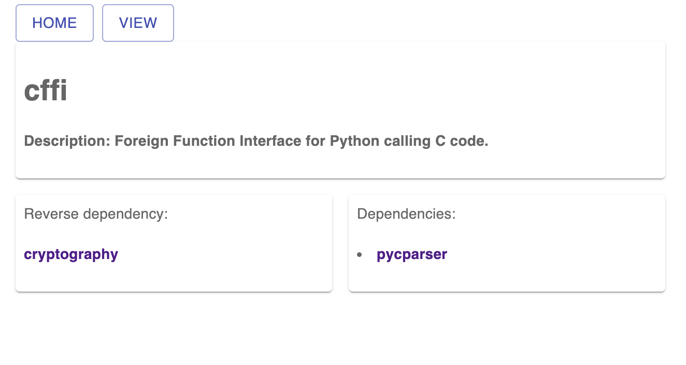

# what's this App about?

#### What
It analyses and presents Python project packages if poetry is your package management tool.
#### How
This App was built with Flask server and React client, it allows users to upload poetry.lock TOML file.
Flask server will parse TOML file from scracth into an ideal Json file, rendered it with React client.

# Run this App

#### Flask server

1. set venv environment
run: python -m venv venv ; source venv/bin/activate
packages: pip3 install flask, pip3 install flask_cors
2. Start it: python app.py

#### React client

1. npm install 
2. npm start

# Demo

[LIVE](https://gentle-mesa-87240.herokuapp.com/)

#### Home

#### View

#### Package Details

#### TOML sample
[Sample](https://github.com/python-poetry/poetry/blob/master/poetry.lock)
